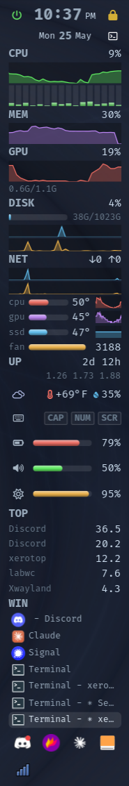
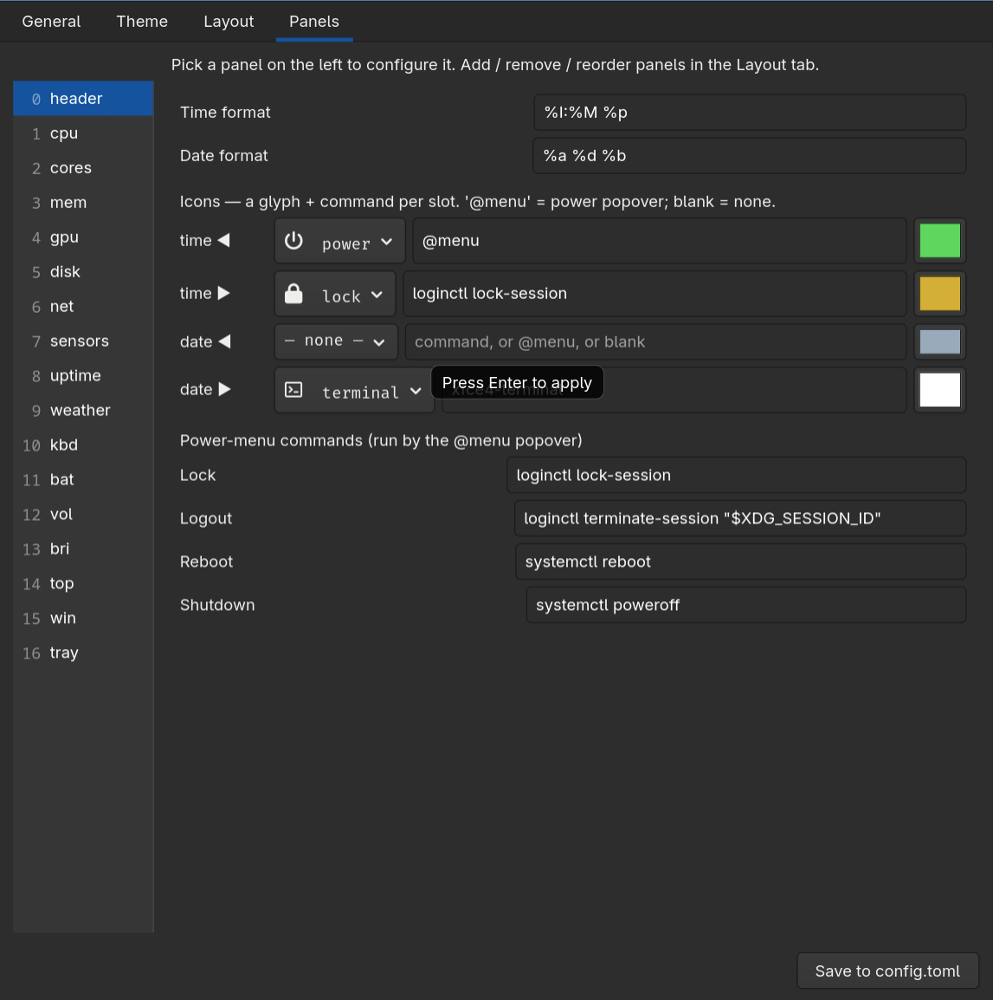

# xerotop



A **gkrellm-style, battery-conscious system monitor** for Wayland (wlroots /
layer-shell), in Rust + GTK4. A vertical (or horizontal) stack of live meters —
CPU (overall + per-core), memory, GPU, disk, network, temps/fans, battery,
volume, brightness, a top process list, uptime, keyboard LEDs, weather, and
maildir counts — plus a real **taskbar** and **system tray with cascading
menus**, all in **one
process** with **zero polling subprocesses**.

It's the successor to an [ewwii](https://github.com/Ewwii-sh/ewwii)-based bar
that spawned ~600 shell processes per second to poll metrics. xerotop reads
`/proc`, `/sys`, ALSA and statvfs natively and redraws only on new data.

## Design principles

- **Battery-first.** One central scheduler, one 250ms timer. Each panel updates
  at its own (possibly fractional) interval; on battery every interval is
  stretched by a configurable multiplier. With `smooth = false` (stepped graphs)
  there are no extra wakeups — graphs redraw only when a new sample arrives. The
  default `smooth = true` adds continuous scrolling via a frame clock (prettier,
  but it does redraw per frame while visible); flip it off for minimal wakeups.
- **Worse-is-better.** Smallest thing that genuinely works, then iterate.
- **Single process.** Metrics, taskbar via wlr-foreign-toplevel, and tray via
  StatusNotifier all live in-process — no IPC, no sockets, no helper daemons.
  (Each Wayland/D-Bus protocol gets its own thread; snapshots stream to GTK over
  channels.)
- **Configure by prefs, not a config language.** Plain, stable TOML. The format
  is boring on purpose and will not be rug-pulled.
- **Orientation-agnostic.** Vertical and horizontal bars share one layout model;
  multiple bars are a planned extension. v1 ships the vertical bar.

## Status — feature-complete vs. the ewwii bar it replaces

Working:

- **layer-shell bar** anchorable to any edge; configurable thickness, length
  (full or fixed px + alignment), stacking layer (top/bottom/overlay/background),
  monitor, and opacity. Graphs use ewwii-style dynamic `min..max` autoscaling.
- meter panels: **CPU**, **CORES** (per-core mini bars), **MEM**, **GPU**,
  **DISK** (usage bar + read/write graphs), **NET**. Each metric panel has a
  per-panel "show label" toggle, so e.g. `cores` can sit under `cpu` headerless.
- **SENSORS** (`sensors`, formerly `temp`): fully configurable — pick any hwmon temp/fan/voltage from a list,
  label/color/reorder each, plus an optional averaged row (bar + trend + value)
- **battery / volume / brightness** as icon + rounded level bar + value, with **scroll/click
  control** (volume via ALSA, brightness via `brightnessctl`, right-click volume
  opens a configurable mixer)
- **TOP** process list (configurable count), **UPTIME** (optional 1/5/15-min
  load averages), **keyboard LEDs** (caps/num/scroll),
  **WEATHER** (wttr.in, no API key — compact icon + temp, full report on hover)
- **MAIL**: maildir unread/total (envelope + count, yellow when unread); counts
  off-thread, hides where there's no maildir, click runs a configured command
- **header**: a styled clock + date with **4 configurable icon slots** (left/right
  of both the time and date), each a custom glyph + command + color (`@menu`
  opens the power popover)
- **tasks** (`tasks`): open windows via wlr-foreign-toplevel — app icons, focus
  highlight, minimized = grayed/italic, left-click activate, right-click minimize
- **system tray** (`tray`): StatusNotifier host — themed/pixmap icons,
  left-click activate, right-click **cascading D-Bus menu** with hover submenus
  and full `AboutToShow` support; menu item ids are resolved by path from the
  freshest layout so apps that renumber mid-open (nm-applet, …) don't misfire
- **live preferences GUI** — right-click any dead space on the bar (gkrellm-style)
  for Preferences/Quit, or run `xerotop --prefs`. Four tabs: **General** (bar
  geometry + power), **Theme**, **Layout** (which panels, drag to reorder), and
  **Panels** (a master-detail pane — pick a panel on the left, configure it on
  the right: interval, graph + label toggles, sensors, weather, mail, tray,
  header icons + commands, volume mixer). Every control applies instantly.
- **themes** — colors + font tiers (small/normal/large) are data, not baked CSS.
  The built-in `default` reproduces the dark look. The Theme tab has two save
  buttons: **Save theme** (palette + fonts) and **Save + panel colors** (also
  bundles the current sensor colors + header buttons); both write
  `~/.config/xerotop/themes/<name>.toml`. Loading a theme that carries panel
  colors applies them, so a theme can capture a full look, not just the palette.

Planned (see `TODO.md`): MPRIS now-playing / network-info panels,
occlusion-aware pausing, multiple bars, horizontal polish.

## Build & run

```sh
cargo build --release
./target/release/xerotop
```

Requires GTK4, `gtk4-layer-shell`, a wlroots compositor (labwc, sway, …), and a
**Nerd Font** for the glyphs — the default theme uses *FiraCode Nerd Font Mono*
(`ttf-firacode-nerd`); without one the clock/sensor/weather/etc. icons render as
tofu boxes. For tray/taskbar/brightness also: a StatusNotifier-capable session,
the foreign-toplevel protocol, and `brightnessctl` on `PATH`.

### Toolchain note

Pinned to **gtk4-rs 0.10** so it builds on Rust **1.89** (gtk4-rs ≥ 0.11 needs
Rust ≥ 1.92). If you install a newer toolchain, bumping `Cargo.toml` to gtk4
0.11 / gtk4-layer-shell 0.8 is a one-liner.

## Configuration

Most people won't touch the file — right-click the bar (or `xerotop --prefs`)
and use the GUI: pick a panel on the left, configure it on the right, everything
applies live.



First run writes `~/.config/xerotop/config.toml`; the equivalent under the hood:

```toml
theme = "default"   # built-in, or a name under ~/.config/xerotop/themes/<name>.toml

[bar]
edge = "right"      # left | right | top | bottom  (left/right = vertical)
thickness = 150     # px: width for vertical bars, height for horizontal
length = "full"     # "full" to fill the edge, or a pixel count (e.g. 600)
align = "center"    # start | center | end  (where a fixed-length bar sits)
layer = "top"       # top | bottom | background | overlay (bottom = windows over bar)
monitor = 0         # output index; -1 = compositor's choice
smooth = true       # continuous graph scrolling on AC; false = stepped (less battery)
smooth_battery = false  # smooth scrolling on battery too (default off = fewer wakeups)
graph_gamma = 1.0   # graph spikiness; 1.0 = linear (ewwii), >1 sharper peaks
meter_thickness = 7 # px thickness of the level bars (bat/vol/bri/disk/fans)
opacity = 0.88      # background opacity: 0.0 transparent .. 1.0 opaque

[power]
battery_interval_multiplier = 2.0   # on battery, multiply every interval by this

[tray]
columns = 8         # max tray icons per row
icon_size = 18

[weather]
location = ""       # city / "lat,lon"; blank = auto by IP
units = "auto"      # auto | c | f
interval_min = 30

[mail]
dir = ""                       # maildir root (has new/ + cur/); blank = ~/.maildir
command = "xfce4-terminal -e mutt"  # run on click
interval_s = 15

[actions]                           # logout/reboot/shutdown power the @menu popover
lock = "loginctl lock-session"
mixer = "pavucontrol"               # right-click the volume meter
# logout / reboot / shutdown ...

# Sensors and header icons are managed in the GUI (the Panels tab's per-panel
# detail); they write [[sensor]] and [[header_button]] entries here.

[[panel]]                           # panels render in order (top→bottom / left→right)
type = "header"
time_format = "%I:%M %p"            # 12-hour; "%H:%M" for 24-hour
date_format = "%a %d %b"
[[panel]]
type = "cpu"
interval = 2                        # seconds; may be fractional (0.5 = 2/sec)
graph = true
show_label = true                   # false = drop the "CPU" header row
# graph_height = 24                 # optional per-panel graph height (px)
# graph_window = 60                 # optional per-panel graph window (seconds)
# ... cores, memory, gpu, disk, net, sensors, weather, mail, uptime, keyboard,
#     battery, volume, brightness, top, tasks, tray
```

## Architecture

| Module | Role |
|---|---|
| `config.rs`  | TOML schema + load/first-run defaults (`Edge`, panels, actions) |
| `power.rs`   | AC/battery detection (`/sys/class/power_supply`) |
| `metrics.rs` | native samplers: cpu (+ per-core), mem, gpu, disk (statvfs), net, hwmon sensor discovery/read, battery, ALSA volume, brightness, keyboard LEDs, uptime |
| `widgets.rs` | reusable `Graph` (multi-series, filled, dynamic min..max), `Bar` level meter, `Cores` per-core bars |
| `panels.rs`  | `Panel` builders + taskbar/tray/weather hosts (icon resolution, cascading menus) |
| `taskbar.rs` | calloop thread: wlr-foreign-toplevel client → toplevel snapshots / actions |
| `tray.rs`    | tokio thread: StatusNotifier host (`system-tray`) → item+menu snapshots / actions |
| `weather.rs` | background thread: wttr.in fetch → weather snapshots over a channel |
| `theme.rs`   | `Theme` (colors + font tiers) → generated stylesheet + graph palette; loads theme files |
| `prefs.rs`   | live preferences GUI (General / Theme / Layout / Panels master-detail), mutates state + `apply()` |
| `bar.rs`     | layer-shell window, `BarHandle::apply()` live re-render, right-click menu, scheduler |
| `main.rs`    | app bootstrap, `--prefs` |
